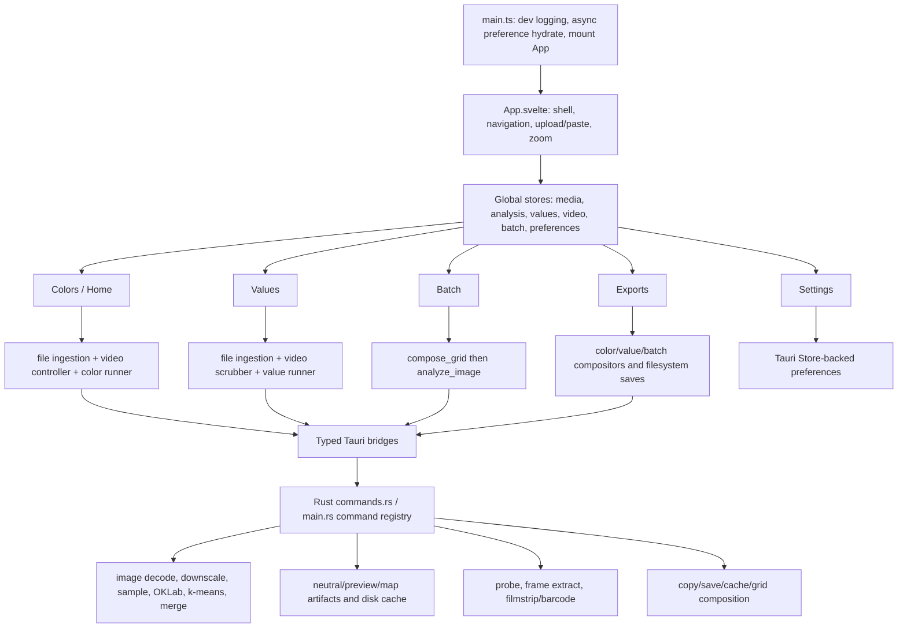

# Control-flow and validated-defect audit

Date: 2026-07-09

Audit worktree: `color-tool-kmeans-review`

Audit branch: `codex/control-flow-audit`

## Outcome

The shipping application control flow was reviewed end to end across the Svelte renderer and Rust/Tauri core. The audit found **21 validated findings: 0 P1, 7 P2, 9 P3, and 5 P4**. Twelve findings have executable expected-failure repros in this worktree; the remaining findings are exact source or configuration invariants.

No production behavior was changed. The only additions are this report and audit-only repro tests.

## Git history and active-work boundary

Final history snapshot taken at approximately 18:05 America/Chicago on 2026-07-09.

| Ref/worktree | State | Audit interpretation |
| --- | --- | --- |
| `origin/main`, tag `v1.0.2`, `e6d7c06` | Published shipping baseline | Product behavior reviewed by this audit. |
| Audit base `68c059a` | Adds EPIC-025/026/027 and IMP-159/160/161 documents | Documentation only; no shipping behavior difference from `v1.0.2`. |
| Local `main`, `4d3bebf` | Eight commits ahead of `origin/main`; tracked state clean | Adds/merges the IMP-159 `kmeans_framesim`, IMP-160 `live_pipe_probe`, and IMP-161 `live_loop_probe` benchmark binaries plus RAG/ADR findings. EPIC-025 and all three tickets completed during this audit. These are fenced under `src-tauri/src/bin/` and do not change the app path. |
| Primary worktree | No tracked changes | Only the pre-existing `.claude/` directory and four design/reference archives remain untracked. No active shipping-code edit was present at the final snapshot. |
| `.claude/worktrees/agent-a770a03f52435aa3c`, `e3fcc2c` | Clean, branch already merged to `main` | Completed IMP-159 benchmark work. Its earlier uncommitted stationary-noise correction is now committed and merged. |
| Planned work | EPIC-026 and EPIC-027 | Product integration for live playback and the notebook UI redesign remain future work; neither changes the audited v1.0.2 control paths yet. |

The post-release committed diff is limited to RAG planning/findings, an ADR/log, and benchmark binaries. Therefore the control-flow conclusions from the isolated `68c059a` audit tree remain applicable to the current shipping application. The brief uncommitted IMP-161 state observed during the audit was completed in `4d3bebf`, not misclassified as a defect.

## Application control flow

Major paths reviewed:

- **Startup and shell:** `main.ts` starts renderer logging, loads preferences asynchronously, and mounts `App.svelte`. `App.svelte` owns global navigation, media upload/paste, drawer state, zoom, and view mounting.
- **Colors/Home:** media selection updates the global active path and image store. `video-controller.svelte.ts` probes video, generates a strip, extracts a settled PNG frame, writes the frame into the logical media entry, and invokes the color analysis runner. `analyze_image` decodes/downscales/samples, converts to OKLab, runs k-means, optionally snaps/merges clusters, and returns a typed response.
- **Values:** its separate ingestion and scrubber factories probe/extract video frames. The runner calls Rust value analysis, which writes cached neutral, preview, and bucket-map artifacts keyed by image ID, levels, and mode.
- **Batch:** pinned entries are composed into `batch-grid.png`; that composite is passed through the same Rust `analyze_image` pipeline and independent batch parameters.
- **Exports:** missing color analysis is generated on demand; color, value, and batch runners create or copy PNG/SVG/CSV/ASE/JSON artifacts through filesystem bridges.
- **Settings:** preferences hydrate the Colors, Batch, Values, export, and display stores and are persisted locally via Tauri Store.
- **Rust boundary:** the command registry covers color/value analysis, file saving/copying, FFmpeg version/probe/frame/strip, and grid composition. CPU-heavy image and clustering logic remains in the Rust core modules.

## Severity model

- **P1:** release-blocking security, unrecoverable data loss, or broad application outage.
- **P2:** major user workflow failure, incorrect analysis attribution, or persistent stale/corrupt result.
- **P3:** functional edge-case failure, resource leak, degraded reliability, or broken development gate.
- **P4:** minor correctness, accessibility, copy, or project-hygiene issue.

## P1 findings

No P1 issue was validated.

## P2 findings

### AUD-001 — A completed Values frame extraction can be attributed to a different video

`syncFromVideoState()` changes the mutable video path/name without invalidating `decodeToken`. The pending callback checks only that token, then reads the new mutable path/name when it invokes `onFrameExtracted`. A frame decoded from video A can therefore be stored and analyzed as video B after a switch.

- Evidence: [`video-scrubber.svelte.ts`](../../tauri-app/src/lib/views/values/video-scrubber.svelte.ts), especially `syncFromVideoState` and the completion at lines 79–85.
- Validation: expected-failure test resolves A's extraction after switching to B and observes the stale callback.
- Context: IMP-158 fixed this class of race in Home but explicitly excluded Values; this is not IMP-159–161 work.

### AUD-002 — Out-of-order Values probes can restore an older video

Values starts probes without a request generation or selected-path guard. When A's slow probe resolves after B's fast probe, A overwrites global `videoState` and becomes active again.

- Evidence: [`file-ingestion-values.svelte.ts`](../../tauri-app/src/lib/views/values/file-ingestion-values.svelte.ts), lines 21–47.
- Validation: expected-failure test resolves B then A and observes final state A.

### AUD-003 — Canceling Colors or Values analysis leaves the request permanently `pending`

Both runner cancellation methods only invalidate local tokens. They do not clear the corresponding global/per-key pending state. Exports refuses to auto-analyze while global Colors state is pending, and a remounted Values view skips an entry already marked pending. Navigating away mid-request can therefore suppress all retries.

- Evidence: [`analysis-runner.svelte.ts`](../../tauri-app/src/lib/views/home/analysis-runner.svelte.ts), lines 42–54; [`value-analysis-runner.svelte.ts`](../../tauri-app/src/lib/views/values/value-analysis-runner.svelte.ts), lines 57–60; [`colors-export-runner.svelte.ts`](../../tauri-app/src/lib/views/exports/colors-export-runner.svelte.ts), lines 73–79.
- Validation: separate expected-failure tests for Colors and Values confirm that cancellation leaves state pending.

### AUD-004 — Reusing a logical video entry for a new frame does not invalidate Values analysis

Home intentionally reuses one frame/media ID as the scrub position changes. `setFile()` replaces that entry but retains `valueAnalysisByKey`, so Values can display and export analysis from the previous frame.

- Evidence: [`image.ts`](../../tauri-app/src/lib/stores/image.ts), lines 105–141; [`video-controller.svelte.ts`](../../tauri-app/src/lib/views/home/video-controller.svelte.ts), frame replacement at lines 249–304.
- Validation: expected-failure test caches Values output at timestamp 1, replaces the same entry at timestamp 2, and observes the old output still selected.

### AUD-005 — Rust Values cache accepts a stale result after same-second source replacement

Disk-cache freshness stores source mtime in whole seconds. Replacing a stable frame file within the same second preserves the cache key and returns analysis for the previous pixels.

- Evidence: [`value_analysis.rs`](../../tauri-app/src-tauri/src/value_analysis.rs), cache validation at lines 120–143 and `file_mtime()` at lines 549–555.
- Validation: Rust expected-panic test overwrites a red source with blue while preserving the same-second timestamp and receives the stale cached result.

### AUD-006 — Removing the active image can promote a raw video into the still-image pipeline

When the active item is removed, `removeFile()` blindly switches to the first remaining entry. If that entry is a raw video, `switchToFile()` sets the `.mp4` as the active image path and clears video state instead of initiating the video-selection flow.

- Evidence: [`image.ts`](../../tauri-app/src/lib/stores/image.ts), lines 191–230.
- Validation: expected-failure store test leaves a raw video after removing the active image and observes it become `selectedFile`.

### AUD-007 — Concurrent Home frame decodes write to the same output file

Home reuses a stable `frameId`, and Rust derives the output solely as `video-frame-{frameId}.png`. Token checks discard a stale promise result but cannot stop its FFmpeg process from writing. An older request can finish last and overwrite the accepted newer frame on disk, changing the pixels underneath the selected path.

- Evidence: [`video-controller.svelte.ts`](../../tauri-app/src/lib/views/home/video-controller.svelte.ts), stable frame ID and overlapping decode path around lines 249–304; [`commands.rs`](../../tauri-app/src-tauri/src/commands.rs), deterministic output at lines 270–299.
- Validation: source invariant—multiple timestamps with one frame ID resolve to exactly one writable path, and no process cancellation/unique generation path exists.

## P3 findings

### AUD-008 — Values drops cached strip metadata when activating a cached video

The cached path restores duration, fps, time, and poster but omits `stripPath` and `stripId`. Barcode/filmstrip state disappears when Values activates a cached video and may be needlessly regenerated later.

- Evidence: [`file-ingestion-values.svelte.ts`](../../tauri-app/src/lib/views/values/file-ingestion-values.svelte.ts), lines 21–32.
- Validation: expected-failure test seeds a cached strip and observes `videoState.stripPath` become absent.

### AUD-009 — Strip-mode changes can be ignored or leave strip generation stuck

The strip-mode setting lives on Settings while Home is unmounted. Home's subscription deliberately ignores its first value on remount, so a mode changed in Settings does not regenerate the current strip. Separately, `regenerateStrip()` rotates the ID and calls a scheduler that refuses to run while `videoStripPending`; the stale request's `finally` then refuses to clear that flag, leaving no replacement request and a permanent pending state.

- Evidence: [`HomeView.svelte`](../../tauri-app/src/lib/views/HomeView.svelte), line 317; [`video-controller.svelte.ts`](../../tauri-app/src/lib/views/home/video-controller.svelte.ts), lines 169–177 and 228–238.
- Validation: expected-failure test changes/regenerates during an in-flight strip and observes no replacement extraction.

### AUD-010 — Path deduplication leaks an unreachable dataset and possibly its object URL

`appendFile()` and `setFile()` add the dataset and preview resource before path deduplication. A duplicate path can be rejected from `images` while its resource remains keyed by an ID no image owns; `clearFile()` cannot release it.

- Evidence: [`image.ts`](../../tauri-app/src/lib/stores/image.ts), lines 105–166.
- Validation: expected-failure test appends two IDs for one path and observes one image but two datasets; clearing the visible entry leaves one dataset behind.

### AUD-011 — Disk-cache retention is not bounded during a running session

Video-cache pruning runs only at startup. Values creates a new random frame ID on every extraction, while value-analysis directories, clipboard images, and persisted frame snapshots have no equivalent pruning/removal lifecycle. A long editing session can continuously grow the cache until restart, and some artifact classes persist across restarts.

- Evidence: [`main.rs`](../../tauri-app/src-tauri/src/main.rs), line 25; [`video-scrubber.svelte.ts`](../../tauri-app/src/lib/views/values/video-scrubber.svelte.ts), lines 61–74; [`value_analysis.rs`](../../tauri-app/src-tauri/src/value_analysis.rs), cache directory creation around lines 105–118; [`frame-snapshot.ts`](../../tauri-app/src/lib/services/frame-snapshot.ts).
- Validation: source trace of every creation and cleanup path; no runtime/session prune or entry-deletion hook exists for these artifacts.

### AUD-012 — TIFF and GIF “source” exports contain non-PNG bytes under a `.png` name

The open dialog supports GIF/TIFF, but source export recognizes only JPEG/PNG/WebP/BMP. Unsupported recognized inputs fall back to a `.png` filename, while `saveFromPath()` copies the original bytes without conversion.

- Evidence: [`fs.ts`](../../tauri-app/src/lib/bridges/fs.ts), supported filters around lines 77–86; [`colors-export-runner.svelte.ts`](../../tauri-app/src/lib/views/exports/colors-export-runner.svelte.ts), lines 287–300.
- Validation: expected-failure test uses a TIFF source and observes a `.png` target name.

### AUD-013 — Navigating away during async drag/drop setup can leak listeners

Home, Values, and Batch install native listeners asynchronously and store the unlisten function only after the promise resolves. If view cleanup happens first, the later listener has no owner and is never removed, causing duplicate or cross-view drop handling.

- Evidence: [`HomeView.svelte`](../../tauri-app/src/lib/views/HomeView.svelte), lines 295–296 and cleanup; [`ValuesView.svelte`](../../tauri-app/src/lib/views/ValuesView.svelte), lines 153–170; [`batch-drop.svelte.ts`](../../tauri-app/src/lib/views/batch/batch-drop.svelte.ts).
- Validation: source lifecycle trace—cleanup checks a still-null local while the unresolved registration promise can subsequently assign it.

### AUD-014 — Barcode generation can omit the tail of long, high-frame-rate videos

The frontend caps barcode thumbnails at 30,000. Rust decides whether to add temporal sampling using an assumed 30 fps. For a clip above 30 fps whose cap is not below 95% of `duration × 30`, FFmpeg receives no fps filter and `tile=30000x1`, consuming the first 30,000 decoded frames rather than sampling the whole duration.

- Evidence: [`ffmpeg.rs`](../../tauri-app/src-tauri/src/ffmpeg.rs), lines 124–146; the frontend strip-count cap in [`video-controller.svelte.ts`](../../tauri-app/src/lib/views/home/video-controller.svelte.ts), lines 165–207.
- Validation: source arithmetic and FFmpeg filter construction; a 60 fps clip can exceed the actual frame cap while failing the 30 fps `needs_fps` comparison.

### AUD-015 — The enabled pre-commit formatting gate is broken

The file is named `prettier.config.cjs` but uses ESM `export default`. Prettier loads it as CommonJS and exits before checking files. The repository pre-commit hook always invokes `format:check`, so developers who follow the documented hook setup cannot commit without bypassing or repairing the gate.

- Evidence: [`prettier.config.cjs`](../../tauri-app/prettier.config.cjs), line 1; [`.githooks/pre-commit`](../../.githooks/pre-commit), line 30.
- Validation: `npm run format:check` exits 2 with `Unexpected token 'export'`.

### AUD-016 — CI does not execute the application test/check suites

Linux CI runs only one of the 14 frontend test files and one Rust integration test. It does not run full `npm test`, `npm run check`, `npm run lint`, `npm run format:check`, or full `cargo test`. The Windows build exercises compilation but not the full suites. Controller/store regressions can merge without a gate.

- Evidence: [`.github/workflows/ci.yml`](../../.github/workflows/ci.yml), especially the single gamut and k-means snapshot steps.
- Validation: workflow source inspection against package scripts and the locally executed suite.

## P4 findings

### AUD-017 — Export timestamps can emit invalid centiseconds

The filename formatter rounds the fractional second independently. At `1.999`, it produces `00m01s100` instead of carrying to `00m02s00`.

- Evidence: [`colors-export-runner.svelte.ts`](../../tauri-app/src/lib/views/exports/colors-export-runner.svelte.ts), lines 109–115.
- Validation: expected-failure test observes the `01s100` filename.

### AUD-018 — A video frame at timestamp zero is classified as a raw video

`isRawVideo()` uses `!item.frameTimestamp`; numeric zero is therefore treated as missing. A valid extracted frame at the start of a video cannot use actions guarded against raw videos, including pinning.

- Evidence: [`MediaBucket.svelte`](../../tauri-app/src/lib/components/MediaBucket.svelte), lines 50–52.
- Validation: direct JavaScript truthiness/source invariant for a valid `frameTimestamp: 0` entry.

### AUD-019 — Settings claims chart visibility applies to Batch, but it does not

Settings binds only the Colors `params` flags and says the choices apply to Colors and Batch. Preference hydration hardcodes all Batch visibility flags to `true`, and Batch renders all three cards unconditionally.

- Evidence: [`SettingsView.svelte`](../../tauri-app/src/lib/views/SettingsView.svelte), lines 75–88; [`preferences.ts`](../../tauri-app/src/lib/stores/preferences.ts), lines 32–47; [`BatchView.svelte`](../../tauri-app/src/lib/views/BatchView.svelte), results cards around lines 346–433.
- Validation: store and render-path trace.

### AUD-020 — Two current interactive hosts retain Svelte accessibility warnings

`svelte-check` reports noninteractive elements with nonnegative `tabindex` in the Home video panel and Values video host.

- Evidence: [`VideoPanel.svelte`](../../tauri-app/src/lib/views/home/VideoPanel.svelte), line 33; [`ValuesView.svelte`](../../tauri-app/src/lib/views/ValuesView.svelte), line 228.
- Validation: `npm run check` returns 0 errors and these 2 warnings.
- Context: this belongs to deferred EPIC-021; do not create a duplicate umbrella issue.

### AUD-021 — RAG state and completion records are internally inconsistent

The generated index reports IMP-099, IMP-112, IMP-124, and IMP-154 open under completed parent epics. IMP-146 is marked completed with every implementation item unchecked and no issues/completion notes. This weakens the index as the required single status entry point.

- Evidence: [`INDEX.md`](../INDEX.md), lines 59–62; [`AI-IMP-146-settings-phrasing-review.md`](../AI-IMP/AI-IMP-146-settings-phrasing-review.md), lines 43–47.
- Validation: generated index and ticket metadata/checklist comparison.

## Audit tests and gates

Audit-only repros:

- [`audit-control-flow-races.spec.ts`](../../tauri-app/src/lib/views/__tests__/audit-control-flow-races.spec.ts): 9 expected-failure controller/store invariants.
- [`audit-export-paths.spec.ts`](../../tauri-app/src/lib/views/__tests__/audit-export-paths.spec.ts): 2 expected-failure export naming invariants.
- [`audit_value_cache.rs`](../../tauri-app/src-tauri/tests/audit_value_cache.rs): 1 expected-panic Rust cache-freshness invariant.

Validation results:

| Gate | Result |
| --- | --- |
| `npm run test -- --run` | Pass: 14 files, 166 tests, including 11 expected-failure repros. |
| `cargo test --offline --workspace` | Pass: 38 tests, including the expected-panic cache repro. |
| `npm run check` | Pass with 0 errors and 2 known accessibility warnings. |
| `npm run lint` | Pass. |
| `npm run build` | Pass with the same 2 accessibility warnings and non-failing Vite chunk warnings. |
| `cargo fmt --all -- --check` | Pass. |
| `cargo clippy --offline --workspace -- -D warnings` | Pass. |
| `git diff --check` | Pass. |
| `npm run format:check` | **Fail:** invalid CommonJS/ESM Prettier configuration (AUD-015). |

## Existing, parallel, and deferred work not counted as new defects

- **EPIC-025 / IMP-159–161:** the live-analysis performance spike ran in parallel with this audit and completed in `4d3bebf`. Current cold-start/PNG-round-trip cost is its stated baseline and is not recast here as a defect. All additions are benchmark-only; EPIC-026 contains future product integration.
- **IMP-124:** deferred unification of duplicate Home/Values video extraction. The duplication itself is not recounted; concrete correctness failures AUD-001, AUD-004, AUD-005, and AUD-007 should inform its reprioritization.
- **IMP-154:** deferred content-only zoom behavior. Not recounted.
- **EPIC-021:** deferred accessibility program. AUD-020 records the current warnings for completeness but should attach to this epic.
- **EPIC-027:** planned notebook UI redesign. Subjective layout/design observations were excluded from this correctness audit.

## Suggested triage order

1. Address the video generation/cache correctness set together: AUD-001, AUD-002, AUD-004, AUD-005, AUD-007, AUD-008, and AUD-009; revisit IMP-124's priority and make generation identity cross both views and disk artifacts.
2. Fix cancellation and invalid media promotion: AUD-003 and AUD-006.
3. Repair resource and export integrity: AUD-010 through AUD-014.
4. Restore repository gates before relying on them: AUD-015 and AUD-016.
5. Fold P4 items into their existing UI/accessibility/RAG maintenance contexts.
