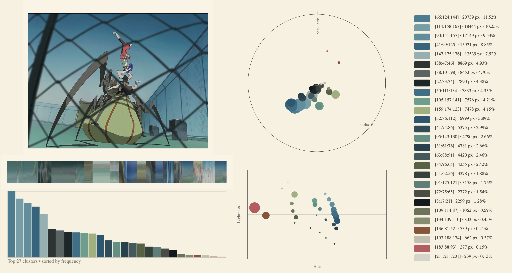
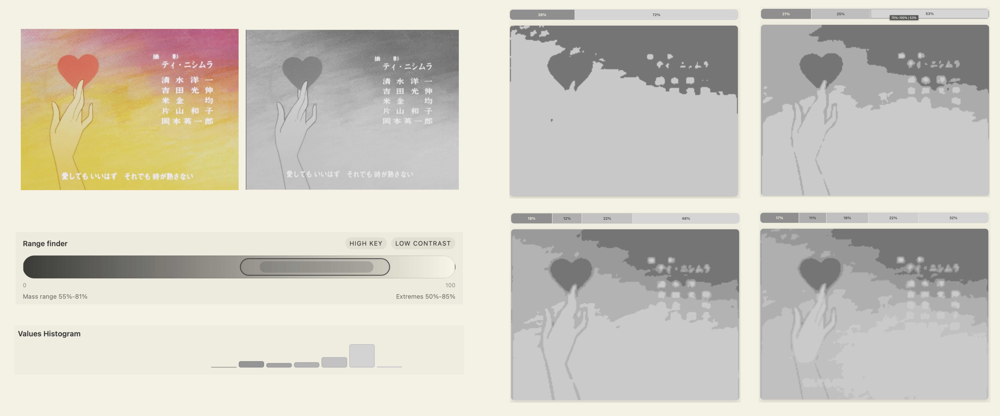
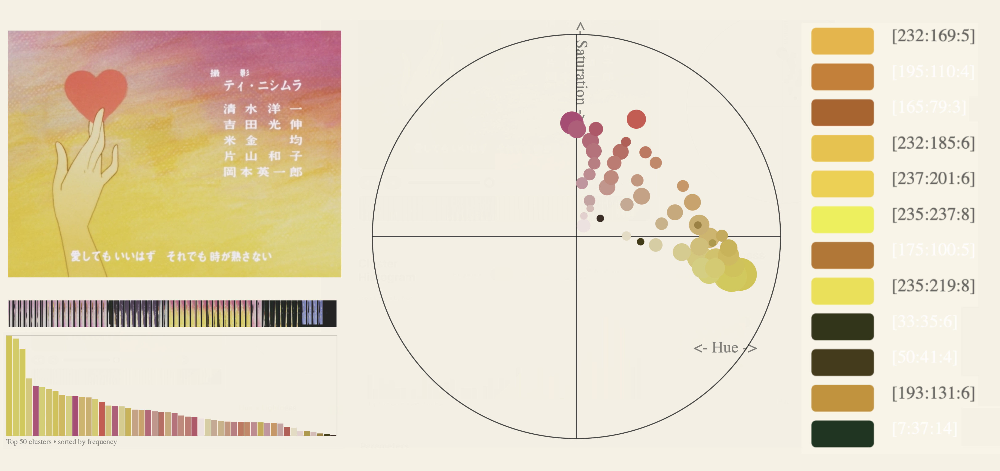

<div align="center">

# Color Tool

**Perceptual color & tonality analysis for artists.**

A desktop app for studying the color and value structure of images and video —
k-means clustering in OKLab/OKLch color space, frame-by-frame video analysis,
batch palettes, and notan/value studies, all exportable.

[](https://github.com/animegolem/color-tool-kmeans/releases/latest)
[](LICENSE)


https://github.com/user-attachments/assets/641e879c-258c-4b8b-9b5f-8c10b1799aec



### [⬇ Download for macOS & Windows](https://github.com/animegolem/color-tool-kmeans/releases/latest)

</div>

---

## What it is

Color Tool helps painters, colorists, and designers *see* how an image is built —
which colors dominate, how chroma and hue are distributed, and how the values read
when you squint. It works on stills **and** video frames, and it can analyze a set
of images together as a single composite palette.

Everything runs locally. Color processing happens in **OKLab/OKLch**, a perceptual
color space where distances match how different colors actually *look* to the eye —
so the clusters and charts reflect perception, not just RGB math.

## Features

**Color analysis** — k-means clustering in OKLab extracts dominant colors, shown as:
- a **polar chart** (hue × chroma) in OKLCH, OKHSV, or HSV ("Gurney circle") mode
- a **cluster histogram** sorted by frequency, hue, or lightness
- a **hue × lightness** scatter plot
- configurable cluster count, sampling quality, exclusions, and merge threshold

**Value / tonality analysis** — lightness distribution from the OKLab L channel:
- configurable tonal buckets (2–5 levels) via k-means
- notan mode (2-tone simplification via Otsu thresholding)
- range finder showing image key (high-key, low-key, full-range)
- neutral grayscale and simplified-tone previews

**Video** — scrub a timeline, analyze any frame, snapshot frames into the library
(ffmpeg-powered, bundled — no separate install).

**Batch** — pin multiple images (or drag-and-drop them in) and analyze the whole set
as one composite palette with the same chart suite.

**Exports** — PNG, SVG, CSV, Adobe `.ase`, and JSON palettes; composite study sheets
for Colors / Values / Batch; right-click any chart to export it directly.

## Gallery

<div align="center">

| Value & notan study | Palette strip |
|:---:|:---:|
|  |  |

</div>

## Download & install

Grab the latest installer from the [**Releases**](https://github.com/animegolem/color-tool-kmeans/releases/latest) page:

| Platform | File |
|---|---|
| macOS (Apple Silicon) | `Color Tool_x.y.z_aarch64.dmg` |
| Windows 10+ (x64) | `Color Tool_x.y.z_x64_en-US.msi` |

The builds are **unsigned**, so the OS warns on first launch:

- **macOS** — right-click the app → **Open** (or run `xattr -cr "/Applications/Color Tool.app"`), then confirm.
- **Windows** — SmartScreen → **More info** → **Run anyway**.

Video features ship with bundled ffmpeg/ffprobe; nothing else to install.

## Why OKLab?

Most palette tools cluster in RGB or HSL, where equal numeric steps don't look equally
different — greens compress, blues stretch, and the resulting "dominant colors" can
misrepresent what you see. Color Tool clusters in **OKLab**, a perceptually uniform
space, so a color that's twice as far in the data really does look about twice as
different. Charts default to **OKLCH** (OKLab in cylindrical hue/chroma/lightness form);
an HSL "Gurney circle" mode is included for artists used to traditional color wheels.

## Build from source

Requires **Node 20**, **Rust (stable)**, and ffmpeg/ffprobe for video.

```bash
cd tauri-app
npm ci
npm run tauri dev          # run in development
npm run tauri build        # produce a release bundle (dmg / msi)
```

ffmpeg/ffprobe are vendored as sidecars; helper scripts in `tauri-app/scripts/`
fetch or build LGPL-licensed binaries. On Linux/NVIDIA/Wayland, launch packaged
builds with `WEBKIT_DISABLE_DMABUF_RENDERER=1` for WebKit stability.

## Tech

[Tauri](https://tauri.app) shell with a **Svelte 5** (runes) frontend and a **Rust**
core: k-means clustering, OKLab/OKLch conversions, and image/video sampling run
natively; ffmpeg handles frame extraction.

## Credits

- OKLab color space by [Björn Ottosson](https://bottosson.github.io/posts/oklab/)
- [ffmpeg](https://ffmpeg.org) for video processing (LGPL)
- Sidebar icons: VS Code Codicons (CC BY 4.0)

## License

MIT — see [`LICENSE`](LICENSE).
